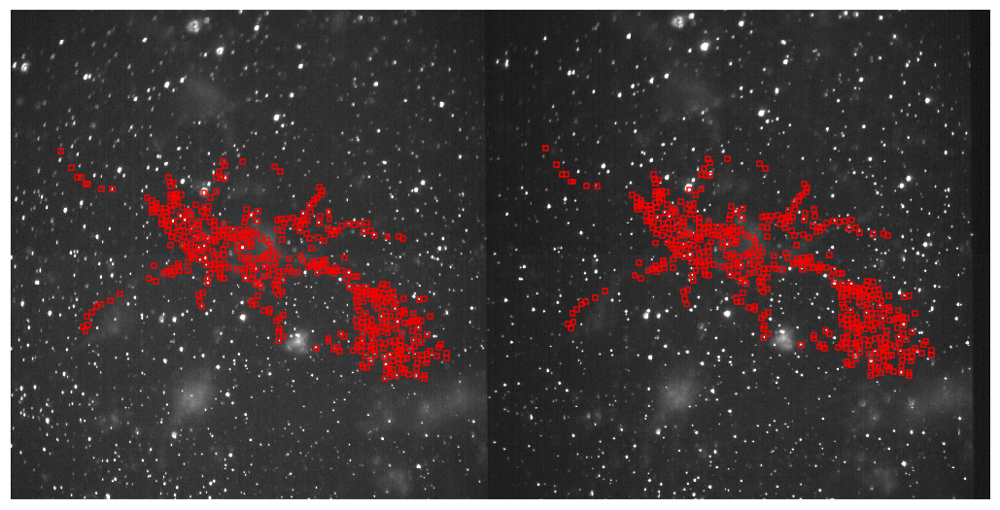
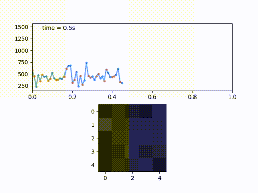

# Voltage-sensitive nanorods for voltage imaging in neurons
Repository for analysis of data from vsNRs published in ..

## About

The scripts we provide here can be used to follow the analysis protocol.


They can be used to spot and classify blinking emitters in cells loaded with them



and analyse individual ROIs




## Getting started

A simple way to start is by following jupyter notebook (mainvsNRs.ipynb) were the workflow has been aranged.

The folders containing adquired images and videos have to follow the structure
```
experiment images folder
│   cellX_BeRST.tif
│   cellX_bf.tif
│
└───control
│   │   cellX_Y1.tif
│   
└───EMCCD-CMOS calib
│   │   calib_CMOS_1.tif
│   │   calib_CMOS_2.tif
│   │   ...
│   │   calib_EMCCD_1.tif
│   │   calib_EMCCD_2.tif
│   │   ...
│
└───wave
    │   cellX_Y2.tif

```

## Requirements

- Python 3
- Jupyter/ipython
- Numpy
- Scipy
- Matplotlib
- Pillow
